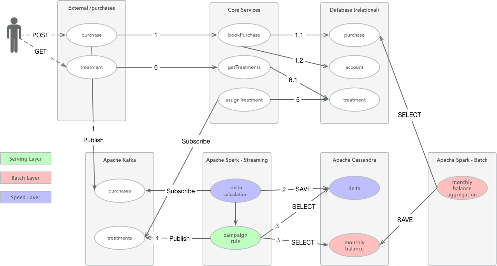
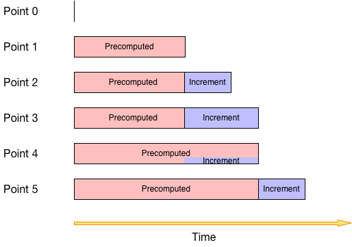

# From Fast to Smart Data

 

#### Lambda Architecture with Apache Spark, Kafka and Cassandra

Today everyone is talking about BigData, FastData, SmartData and Realtime Decisioning. But what is it all about? Why and especially how to do it?

My definition of Fast Data basically is: BigData but coming fast. Smart Data means: BigData is nothing worth, if you not gather relvant information out of it (immediately).

This example should provide **one** way how to implement a realtime lambda usecase (more about [lambda architecture](
http://jameskinley.tumblr.com/post/37398560534/the-lambda-architecture-principles-for)).

The basic idea is: `query = function(all data)` where `all data` is `precomputed + increment`.

The choosen technologies are: 

- [Apache Kafka (0.10.1.0)](http://kafka.apache.org/0101/documentation.html)
- [Apache Spark (2.0.2)](http://spark.apache.org/docs/2.0.2/) and [Streaming (2.0.2)](http://spark.apache.org/docs/2.0.2/streaming-programming-guide.html) with [Kafka Integration (010)](http://spark.apache.org/docs/2.0.2/streaming-kafka-0-10-integration.html)
- [Apache Cassandra (3.9)](http://cassandra.apache.org/doc/3.9/)

Beside those there is [Springboot (1.4.2)](http://docs.spring.io/spring-boot/docs/1.4.2.RELEASE/reference/htmlsingle/) used as service implementation.

Why this techologies? Let's say, they are currently on-the-rise. Of course there are a lot of alternatives, just google.

### Usecase

Let's assume we are a loyalty programme provider and we want to provide realtime marketing. Let's clarifiy realtime in this case: try to be as fast as possible to achieve highest possible relevancy of the decision for the member.

Campaign rule: A customer is collecting loyalty points and if his current monthly balance is higher than 199 he will receive a treatment.

### Architecture

Lambda contains of three parts: Batch-, Speed- and Serving-Layer.

Batch Layer is triggered regularly, e.g. every 24h.

### Lambda

Following should somehow give you an idea what is meant by lambda

- **Point 0:** the initial start of your application
- **Point 1:** your first batch has started and created precomputed values. There is now a cut-off time X.
- **Point 2:** everything introduced into your system after X will be an incremental
- **Point 3:** still there was no further batch run, so still incrementing
- **Point 4:** there is another batch run, so the old increment is now part of the precomputed and you have a new value X (any increment stored before X will not be considered anymore).
- **Point 5:** basically same as Point 3, but now further in time

At any given time your total information is: `precomputed + increment`.

### Implementation

1. REST resource *Purchase*
	2. 	send to kafka topic `purchases`
	3. process the purchase event (save and update member account)
4. Apache Spark Job to aggregate the purchases into monthly balance (Batch Layer - Precomputed View)
5. Apache Spark Streaming Job for kafka topic `purchases`
   6. does the delta calculation for monthly balance (Speed Layer - Incremental View)
   7. evaluates the rule conditions (Serving Layer)

(and of course there is some more around to have a fully working usecase)

### Let's go!

- [Setup & Installation](doc/Installation.md)
- [Run and Play](doc/Run.md)

## References

http://jameskinley.tumblr.com/post/37398560534/the-lambda-architecture-principles-for