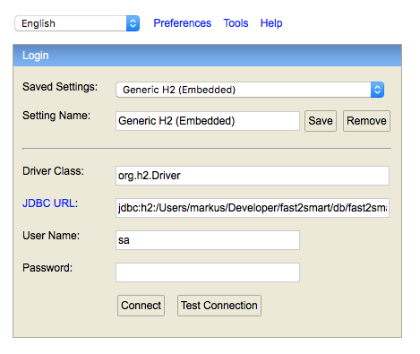
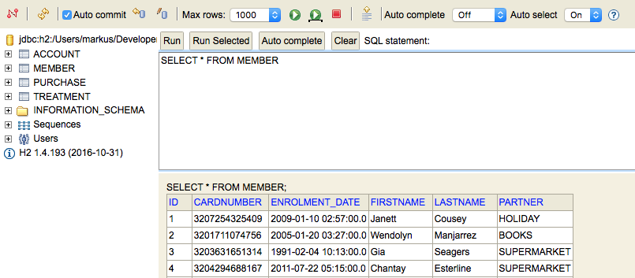

## Run and Play

Note: The application is internally using a [H2](http://www.h2database.com/html/main.html) filebased database.

#### Build

In order to do a full build, just run

```bash
./fast2smart/gradlew clean build

...

BUILD SUCCESSFUL

Total time: 1 mins 37.233 secs
```

It already includes unit and integration tests using.


#### Run Application

```bash
./fast2smart/gradlew bootRun

...

:external:bootRun
  ______        _     ___     _____                      _     _____        _
 |  ____|      | |   |__ \   / ____|                    | |   |  __ \      | |
 | |__ __ _ ___| |_     ) | | (___  _ __ ___   __ _ _ __| |_  | |  | | __ _| |_ __ _
 |  __/ _` / __| __|   / /   \___ \| '_ ` _ \ / _` | '__| __| | |  | |/ _` | __/ _` |
 | | | (_| \__ \ |_   / /_   ____) | | | | | | (_| | |  | |_  | |__| | (_| | || (_| |
 |_|  \__,_|___/\__| |____| |_____/|_| |_| |_|\__,_|_|   \__| |_____/ \__,_|\__\__,_|

10:56:57.472 [restartedMain] INFO  net.fast2smart.external.Application - Starting Application on lucky.fritz.box with PID 2260 (/Users/markus/Developer/fast2smart/external/build/classes/main started by markus in /Users/markus/Developer/fast2smart/external)

...

10:57:10.711 [restartedMain] INFO  o.s.b.c.e.t.TomcatEmbeddedServletContainer - Tomcat started on port(s): 8080 (http)
10:57:10.743 [restartedMain] INFO  net.fast2smart.external.Application - Started Application in 14.106 seconds (JVM running for 15.264)

```

#### Create Sample Data

In order to generate sample data, there are two [Gatling](http://gatling.io/#/) simulations.

```bash
./fast2smart/gradlew gatlingRun-net.fast2smart.simulation.Historic


================================================================================
2016-11-20 11:16:58                                          62s elapsed
---- Requests ------------------------------------------------------------------
> Global                                                   (OK=10950  KO=0     )
> EnrolMember                                              (OK=3707   KO=0     )
> Purchase                                                 (OK=7243   KO=0     )

---- Historical Data Simulation ------------------------------------------------
[##########################################################################]100%
          waiting: 0      / active: 0      / done:20
================================================================================

11:16:58.078 [GatlingSystem-akka.actor.default-dispatcher-9] INFO  i.gatling.core.controller.Controller - StatsEngineStopped
Simulation net.fast2smart.simulation.Historic completed in 60 seconds
Parsing log file(s)...
11:16:58.192 [main] INFO  i.gatling.charts.stats.LogFileReader - Collected ArrayBuffer(/Users/markus/Developer/fast2smart/external/build/reports/gatling/historic-1479636955990/simulation.log) from historic-1479636955990
11:16:58.217 [main] INFO  i.gatling.charts.stats.LogFileReader - First pass
11:16:58.460 [main] INFO  i.gatling.charts.stats.LogFileReader - First pass done: read 10991 lines
11:16:58.509 [main] INFO  i.gatling.charts.stats.LogFileReader - Second pass
11:16:59.498 [main] INFO  i.gatling.charts.stats.LogFileReader - Second pass: read 10991 lines
Parsing log file(s) done
Generating reports...

================================================================================
---- Global Information --------------------------------------------------------
> request count                                      10950 (OK=10950  KO=0     )
> min response time                                      8 (OK=8      KO=-     )
> max response time                                    892 (OK=892    KO=-     )
> mean response time                                   103 (OK=103    KO=-     )
> std deviation                                         77 (OK=77     KO=-     )
> response time 50th percentile                         84 (OK=84     KO=-     )
> response time 75th percentile                        131 (OK=131    KO=-     )
> response time 95th percentile                        239 (OK=239    KO=-     )
> response time 99th percentile                        393 (OK=393    KO=-     )
> mean requests/sec                                179.508 (OK=179.508 KO=-     )
---- Response Time Distribution ------------------------------------------------
> t < 800 ms                                         10949 (100%)
> 800 ms < t < 1200 ms                                   1 (  0%)
> t > 1200 ms                                            0 (  0%)
> failed                                                 0 (  0%)
================================================================================
```

This simulation is creating members (in this run it did 3707) which already purchased (total 7243) lot's of things.


#### Batch Aggregation

Now let's run our aggregation job (we use Spark in embedded local mode here, instead of submitting to the cluster).


```bash
./fast2smart/gradlew aggregation
```
```sql

# Purchase from database
+---+------+-----------+--------+---------------------+-----------+-------------+---------+
|ID |AMOUNT|BASE_POINTS|CURRENCY|DATE                 |PARTNER    |STATUS_POINTS|MEMBER_ID|
+---+------+-----------+--------+---------------------+-----------+-------------+---------+
|1  |4.99  |5          |EUR     |2016-10-29 09:01:30.0|ECOMMERCE  |45           |1        |
|2  |44.89 |22         |EUR     |2002-10-07 11:56:00.0|BOOKS      |88           |5        |
|3  |16.12 |8          |EUR     |1997-06-14 23:39:00.0|HOLIDAY    |0            |19       |
|4  |70.97 |35         |EUR     |2006-03-09 14:05:00.0|BOOKS      |35           |8        |
|5  |3.65  |1          |EUR     |2005-09-05 21:37:00.0|ECOMMERCE  |4            |4        |
|6  |25.80 |12         |EUR     |1999-07-19 12:29:00.0|BOOKS      |24           |21       |
|7  |12.73 |6          |EUR     |2005-03-29 19:25:00.0|HOLIDAY    |54           |15       |
|8  |85.44 |42         |EUR     |2011-04-27 13:49:00.0|BOOKS      |126          |18       |
|9  |17.63 |8          |EUR     |2002-10-15 01:06:00.0|SUPERMARKET|56           |3        |
|10 |2.43  |1          |EUR     |2001-07-28 10:04:00.0|ECOMMERCE  |3            |20       |
+---+------+-----------+--------+---------------------+-----------+-------------+---------+
only showing top 10 rows

# Aggregated view by member, year, month. Calculated the sum of BASE_POINTS + STATUS_POINTS and last considered purchase DATE.
+------+----+-----+------+---------------------+
|member|year|month|amount|maxdate              |
+------+----+-----+------+---------------------+
|10    |2009|5    |119   |2009-05-22 05:19:00.0|
|188   |1991|5    |2     |1991-05-28 19:18:00.0|
|290   |1998|1    |50    |1998-01-29 21:24:00.0|
|287   |2003|7    |36    |2003-07-22 06:10:00.0|
|698   |1991|8    |450   |1991-08-21 06:21:00.0|
|778   |2009|4    |64    |2009-04-05 02:29:00.0|
|786   |1990|3    |72    |1990-03-20 15:04:00.0|
|1046  |1997|4    |28    |1997-04-13 04:23:00.0|
|1085  |1995|5    |11    |1995-05-23 23:54:00.0|
|1127  |2002|6    |168   |2002-06-02 07:41:00.0|
+------+----+-----+------+---------------------+
only showing top 10 rows
```

#### Have a look into Apache Cassandra

Now we should already see plenty of *Batch Layer - Precomputed View* entries

SSH into one of the analytics nodes:

```bash
lucky:fastdata-cluster markus$ vagrant ssh cassandra-1
Last login: Mon Jan  2 12:35:53 2017 from 10.0.2.2
[vagrant@cassandra-1 ~]$ cqlsh
```

```sql
cqlsh> SELECT * FROM fast2smart.member_monthly_balance LIMIT 10;

-- maxdate = last considered purchase
 member | year | month | amount | maxdate
--------+------+-------+--------+---------------------------------
   1535 | 1994 |     2 |    112 | 1994-02-19 10:02:00.000000+0000
   1535 | 2000 |     5 |    150 | 2000-05-18 21:16:00.000000+0000
   1535 | 2004 |     8 |    228 | 2004-08-22 07:55:00.000000+0000
   1535 | 2004 |     9 |     22 | 2004-09-26 02:41:00.000000+0000
   1929 | 1991 |     4 |     30 | 1991-04-23 04:49:00.000000+0000
   1929 | 2001 |    10 |    136 | 2001-10-01 03:47:00.000000+0000
   1235 | 1998 |     7 |    343 | 1998-07-18 21:50:00.000000+0000
   1235 | 2013 |     4 |    470 | 2013-04-21 04:19:00.000000+0000
    990 | 2000 |    10 |     12 | 2000-10-16 01:09:00.000000+0000
   1041 | 1991 |     9 |    246 | 1991-09-19 20:44:00.000000+0000

(10 rows)
cqlsh> 

```

but no *Speed Layer - Incremental View* enties so far.

```sql
cqlsh> SELECT * FROM fast2smart.member_delta_balance LIMIT 10;

 member | year | month | amount | maxdate
--------+------+-------+--------+---------

(0 rows)
cqlsh> 
```


#### Start Streaming

In order to start the Streaming part

1. you have to copy `fast2smart/spark/build/libs/spark-0.1.0-all.jar` to `fastdata-cluster/exchange`.
2. Next get into one of the hadoop nodes and submit the job to Spark

```bash
lucky:fastdata-cluster markus$ vagrant ssh hadoop-1
Last login: Sat Jan 14 13:14:53 2017 from 10.0.2.2
[vagrant@hadoop-1 ~]$ spark-submit --master yarn --class net.fast2smart.streaming.PurchaseStreaming --conf spark.yarn.submit.waitAppCompletion=false --deploy-mode cluster --executor-memory 1G --num-executors 3  /vagrant/exchange/spark-0.1.0-all.jar

```

See if it is running: [http://hadoop-1:8080](http://hadoop-1:8080)

Navigate to Application Master UI (check the application in RUNNING state and on the right side click Application Master), e.g. [http://hadoop-1:8088/proxy/application_1492940607011_0001](http://hadoop-1:8088/proxy/application_1492940607011_0001).

**Note:** the streaming job will process all historic purchases as well, but since we already run once the aggregation there will be no deltas, since the cut-off is always latest purchase date (=maxdate) been in aggregation run.


Get into one of the analytics nodes again and run `cqlsh`.

```sql
cqlsh> SELECT * FROM fast2smart.member_delta_balance LIMIT 10;

 member | year | month | amount | maxdate
--------+------+-------+--------+---------

(0 rows)
```

#### Create more sample data

```bash
./fast2smart/gradlew gatlingRun-net.fast2smart.simulation.Current
```

This simulation is taking members from database and adding purchases beeing after the historic run.


#### Have a look into Apache Cassandra

Now since we create *future* records (means after maxdate beeing aggregated), we should have several delta entries.

Get into one of the analytics nodes again and run `cqlsh`.

```sql
cqlsh> SELECT * FROM fast2smart.member_delta_balance LIMIT 10;

 member | year | month | amount | maxdate
--------+------+-------+--------+---------------------------------
    655 | 2015 |     1 |     56 | 2015-01-14 15:29:00.000000+0000
    655 | 2015 |     2 |    338 | 2015-02-27 20:02:00.000000+0000
    655 | 2015 |     3 |    333 | 2015-03-14 13:17:00.000000+0000
    655 | 2015 |     4 |    186 | 2015-04-23 15:16:00.000000+0000
    655 | 2015 |     5 |    450 | 2015-05-20 18:02:00.000000+0000
    655 | 2015 |     7 |     40 | 2015-07-07 19:03:00.000000+0000
    655 | 2015 |     8 |    154 | 2015-08-30 00:43:00.000000+0000
    655 | 2015 |     9 |    144 | 2015-09-12 00:06:00.000000+0000
    655 | 2015 |    10 |    303 | 2015-10-03 11:03:00.000000+0000
    655 | 2015 |    11 |    126 | 2015-11-09 09:58:00.000000+0000

(10 rows)
```


#### Have a look into Apache Kafka

Let's have a look into the kafka topic `treatments`. There should be lots of treatments for all members, since now several members should have met the criteria of > 199 points in month of a purchase.

SSH into one of the kafka nodes:

```bash
lucky:fastdata-cluster markus$ vagrant ssh kafka-1
Last login: Mon Jan  2 12:35:53 2017 from 10.0.2.2
[vagrant@kafka-1 ~]$
```

Create a console consumer to retrieve messages:

```

kafka-console-consumer.sh --bootstrap-server kafka-1:9092 --topic treatments --from-beginning

...

{"member":"1640","partner":"ECOMMERCE","headline":"5x Points Booster"}
{"member":"395","partner":"SUPERMARKET","headline":"5x Points Booster"}
{"member":"2869","partner":"ECOMMERCE","headline":"5x Points Booster"}
{"member":"2382","partner":"SUPERMARKET","headline":"5x Points Booster"}
{"member":"746","partner":"ECOMMERCE","headline":"5x Points Booster"}

...
```

Another interseting thing is to see if subscriber to a topic is done with its work.

```bash
[vagrant@kafka-1 ~]$ kafka-consumer-groups.sh --bootstrap-server kafka-1:9092 --group purchase-streaming --describe
GROUP                          TOPIC                          PARTITION  CURRENT-OFFSET  LOG-END-OFFSET  LAG             OWNER
purchase-streaming             purchases                      0          5499            5499            0               consumer-1_/192.168.10.8
purchase-streaming             purchases                      1          5512            5512            0               consumer-1_/192.168.10.8
purchase-streaming             purchases                      2          5410            5410            0               consumer-1_/192.168.10.8
purchase-streaming             purchases                      3          5541            5541            0               consumer-1_/192.168.10.8
purchase-streaming             purchases                      4          5628            5628            0               consumer-1_/192.168.10.8
purchase-streaming             purchases                      5          5478            5478            0               consumer-1_/192.168.10.8
```

A *LAG* of 0 indicates that all records have been processed already. `purchase-streaming` is the subscriber in Streaming job.


#### Have a look into H2 database

```bash
./fast2smart/gradlew h2console
```

A browser window should automatically open (http://localhost:8082/).



The connection string is, where you have to replace `${YOUR_DIRECTORY}` with one containg the `fast2smart` repositoriy clone (e.g. /Users/markus/Developer).

```
jdbc:h2:${YOUR_DIRECTORY}/fast2smart/db/fast2smart;AUTO_SERVER=TRUE
```

Click Connect




#### Some curl commands

##### Enrol member

```bash
curl -H "Content-Type:application/json" -v -d @fast2smart/data/member.json http://localhost:8080/members
> POST /members HTTP/1.1

< HTTP/1.1 200 

http://localhost:8080/members/3200603526163
 {
   "lastname" : "Helbig",
   "firstname" : "Markus",
   "card" : {
     "number" : 3200603526163,
     "partner" : "HOLIDAY"
   },
   "enrolmentDate" : "2016-10-29T09:00:00",
   "_links" : {
     "self" : {
       "href" : "http://localhost:8080/members/3200603526163"
     },
     "account" : {
       "href" : "http://localhost:8080/members/3200603526163/account"
     },
     "treatments" : {
       "href" : "http://localhost:8080/members/3200603526163/treatments"
     },
     "purchases" : {
       "href" : "http://localhost:8080/members/3200603526163/purchases"
     }
   }
 }


```

##### Let the member do a purchase

```bash
curl -H "Content-Type:application/json" -v -d @fast2smart/data/purchase.json http://localhost:8080/purchases
> POST /purchases HTTP/1.1

< HTTP/1.1 200 

{
  "cardnumber" : 3200603526163,
  "partner" : "ECOMMERCE",
  "amount" : 4.99,
  "currency" : "EUR",
  "basePoints" : 5,
  "statusPoints" : 45,
  "date" : "2016-10-29T09:01:30",
  "_links" : {
    "member" : {
      "href" : "http://localhost:8080/members/3200603526163"
    },
    "account" : {
      "href" : "http://localhost:8080/members/3200603526163/account"
    }
  }
}

```

##### See members data

```bash
curl http://localhost:8080/members/3200603526163

{
  "lastname" : "Helbig",
  "firstname" : "Markus",
  "card" : {
    "number" : 3200603526163,
    "partner" : "HOLIDAY"
  },
  "enrolmentDate" : "2016-10-29T09:00:00",
  "_links" : {
    "self" : {
      "href" : "http://localhost:8080/members/3200603526163"
    },
    "account" : {
      "href" : "http://localhost:8080/members/3200603526163/account"
    },
    "treatments" : {
      "href" : "http://localhost:8080/members/3200603526163/treatments"
    },
    "purchases" : {
      "href" : "http://localhost:8080/members/3200603526163/purchases"
    }
  }
}

```

you can follow any link provided to see more details.